# 🏥 MediQueue — Smart Hospital Appointment & Queue Management

<p align="center">
  <strong>Smart Healthcare. Smarter Queues.</strong><br>
  A Flutter-based Smart Hospital Appointment & Queue Management application for multi-specialty hospitals.
</p>

<p align="center">
  <a href="https://stitch.withgoogle.com/projects/6637076470176643694">
    
  </a>
  &nbsp;
  <a href="https://stitch.withgoogle.com/projects/6637076470176643694">
    
  </a>
  &nbsp;
  <a href="https://docs.google.com/document/d/1eiYQcvVTjwRtYDwx9UrUwjleejZ6VAGa2j5WTkPsyL0/edit?usp=sharing">
    
  </a>
  &nbsp;
  <a href="https://github.com/RaginiSingh2024/smart-hospital-appointment-queue-flutter">
    
  </a>
</p>

<p align="center">
  
  
  
  
  
</p>

---

## 📌 Project Overview

**MediQueue — Smart Hospital Appointment & Queue Management** is a cross-platform Flutter application developed for **PS 147**. The application provides a digital platform for patients, doctors, and hospital administrators to manage appointments, doctor availability, digital check-in, queues, notifications, and hospital operations.

Patients can discover doctors, search by specialty, view availability, book appointments, receive token/queue information, complete QR-based check-in, track queues, manage appointments, receive notifications, and view consultation history.

Doctors can manage availability, appointments, patient queues, and consultation-related workflows, while administrators can manage doctors, departments, appointments, patient flow, queues, and analytics.

## 🎯 Problem Statement

Hospitals often face challenges such as:

- Long patient waiting times
- Manual appointment management
- Lack of real-time queue visibility
- Difficulty finding available doctors
- Inefficient patient-flow management
- Manual check-in procedures
- Limited communication regarding appointment status

MediQueue provides a digital solution for doctor discovery, appointment booking, dynamic slots, digital check-in, token and queue management, notifications, doctor management, hospital administration, and appointment analytics.

## ✨ Key Features

### 👤 Patient
- 🔐 Role-based authentication
- 🔎 Doctor search and specialty filtering
- 🏥 Department selection
- 👨‍⚕️ Doctor profiles and availability
- 📅 Dynamic appointment slots
- 📌 Appointment booking
- 🔄 Reschedule and cancel appointments
- 🎫 Digital token / queue number
- ⏱️ Estimated waiting time
- 📊 Live queue status
- 📱 QR-based check-in
- 🔔 Appointment and queue notifications
- 💳 Digital payment flow
- 📜 Consultation and appointment history
- 👤 Patient profile

### 👨‍⚕️ Doctor
- 📊 Doctor dashboard
- 📅 Availability management
- 🕐 Appointment slot management
- 📋 Today's appointments
- 🎫 Patient queue
- ▶️ Call next patient
- 🔄 Appointment status management
- 👤 Patient information
- 📈 Appointment statistics

### 👨‍💼 Admin
- 📊 Admin dashboard
- 👨‍⚕️ Doctor management
- 🏥 Department management
- 📅 Appointment management
- 👥 Patient-flow monitoring
- 🎫 Queue monitoring
- 📈 Appointment analytics
- 💰 Payment/revenue overview
- 📊 Hospital statistics
- 📋 Reports and management tools

## 🔄 Appointment Workflow

```text
Patient Login
    ↓
Find Doctor
    ↓
Select Department / Specialty
    ↓
View Doctor Details
    ↓
Check Availability
    ↓
Select Appointment Slot
    ↓
Book Appointment
    ↓
Digital Payment
    ↓
Appointment Confirmation
    ↓
Token / Queue Number
    ↓
QR Check-in
    ↓
Live Queue Tracking
    ↓
Doctor Consultation
    ↓
Consultation History
```

## 🎫 Queue Management

The application provides a digital queue management workflow designed to reduce unnecessary waiting inside hospitals.

Patients can view the current serving token, their token number, queue position, estimated waiting time, appointment status, and queue updates.

Doctors can view waiting patients, call the next patient, update patient status, and complete appointments.

## 📱 QR Code Check-In

Patients can use a generated QR code for digital appointment check-in.

```text
Appointment Confirmation
        ↓
Generate QR Code
        ↓
Patient Arrives
        ↓
Scan QR Code
        ↓
Digital Check-In
        ↓
Queue Activation
```

## 🔔 Notifications

Notifications may include appointment confirmation, reminders, queue updates, doctor availability updates, appointment status changes, and patient-turn notifications.

## 💳 Pricing Strategy

| Pricing Component | Indicative Range |
|---|---:|
| Appointment Convenience Fee | ₹20 – ₹50 |
| Premium Priority Consultation | ₹100 – ₹300 |
| Hospital Subscription Packages | Subscription-based |
| Corporate Healthcare Packages | Organization-based |

The payment functionality is implemented as a demonstration/development flow for the academic project.

## 🔥 Firebase Integration

Firebase is used as the backend infrastructure for authentication, cloud data storage, and real-time application services.

### Firebase Services
- Firebase Authentication
- Cloud Firestore
- Firebase Cloud Messaging
- Real-time data synchronization

Firestore application data includes users, doctors, departments, appointments, time slots, queues, notifications, payments, and consultations.

## 🌐 REST API Integration

The application follows a service/repository architecture for REST API integration. The API layer is separated from the presentation layer to maintain a modular architecture.

REST API communication can support appointment management, patient records, doctor information, doctor availability, and queue-related operations.

## 📡 Offline Caching

The application supports offline caching for important previously loaded information such as appointment details, doctor information, previous appointment data, and queue-related information.

## 🧑‍💻 Technology Stack

| Technology | Purpose |
|---|---|
| Flutter | Cross-platform application development |
| Dart | Programming language |
| Firebase Authentication | User authentication |
| Cloud Firestore | Database |
| Firebase Cloud Messaging | Notifications |
| Riverpod | State management |
| GoRouter | Application navigation |
| Dio | REST API communication |
| Hive / Shared Preferences | Local caching |
| QR Flutter | QR generation |
| Mobile Scanner | QR scanning |
| Connectivity Plus | Network connectivity |
| FL Chart | Analytics and charts |
| Intl | Date and time handling |

## 🏗️ Application Architecture

The application follows a modular and repository-based architecture.

```text
lib/
├── app/
│   ├── routes/
│   └── theme/
├── core/
│   ├── constants/
│   ├── services/
│   ├── utils/
│   └── widgets/
├── models/
├── providers/
├── repositories/
├── features/
│   ├── auth/
│   ├── patient/
│   ├── doctor/
│   └── admin/
└── main.dart
```

## 👥 User Roles

| Role | Main Responsibilities |
|---|---|
| 👤 Patient | Doctor discovery, booking, QR check-in, queue tracking, notifications, history |
| 👨‍⚕️ Doctor | Availability, appointments, patient queue, consultation workflow |
| 👨‍💼 Administrator | Doctors, departments, appointments, queues, analytics and hospital operations |

## 📸 Screenshots

The following screenshots demonstrate the implemented application interfaces across patient, doctor, administrator, Firebase, and project workflows.

<table>
  <tr>
    <td align="center">
      <strong>Patient Registration</strong><br><br>
      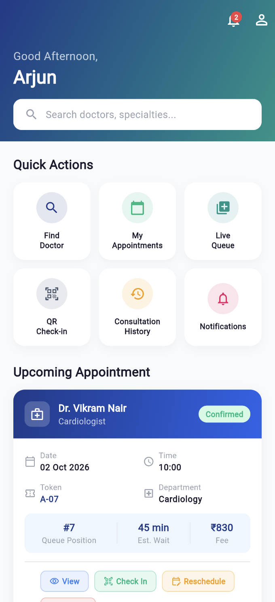
    </td>
    <td align="center">
      <strong>Admin Login</strong><br><br>
      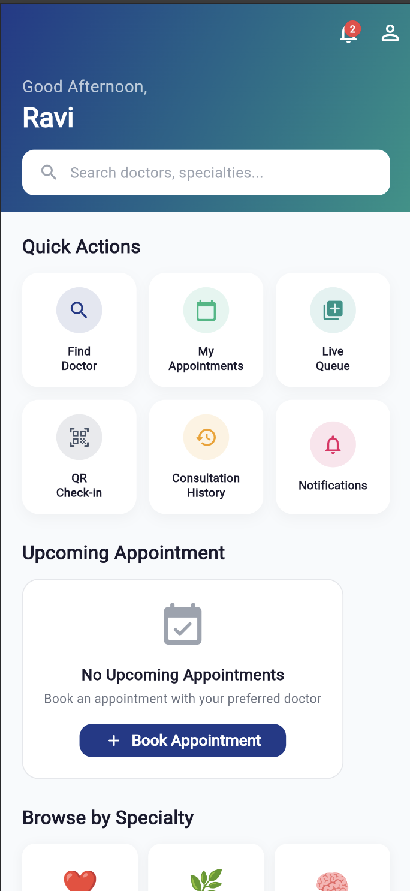
    </td>
  </tr>

  <tr>
    <td align="center">
      <strong>Patient Dashboard</strong><br><br>
      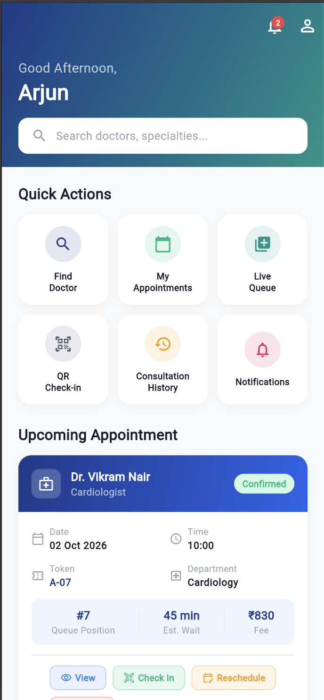
    </td>
    <td align="center">
      <strong>Doctor Search</strong><br><br>
      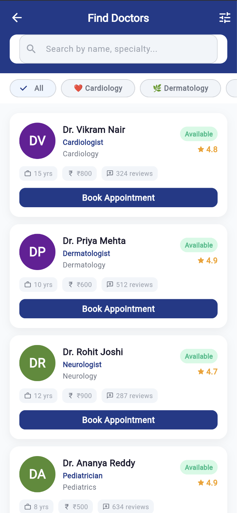
    </td>
  </tr>

  <tr>
    <td align="center">
      <strong>Appointment Booking</strong><br><br>
      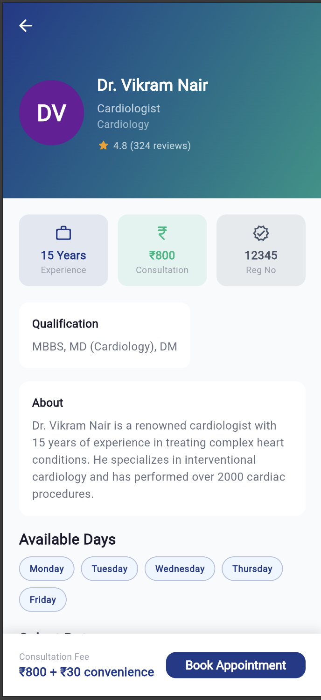
    </td>
    <td align="center">
      <strong>Booking Confirmation</strong><br><br>
      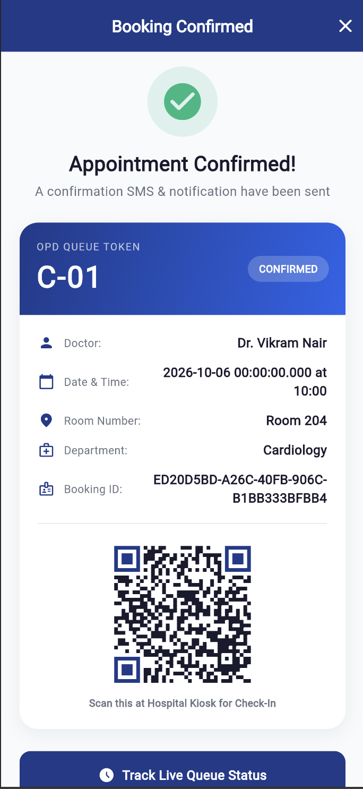
    </td>
  </tr>

  <tr>
    <td align="center">
      <strong>Appointment Details</strong><br><br>
      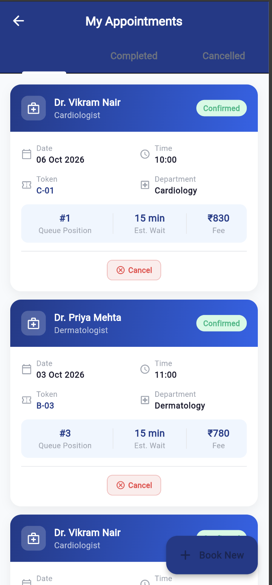
    </td>
    <td align="center">
      <strong>Home Dashboard</strong><br><br>
      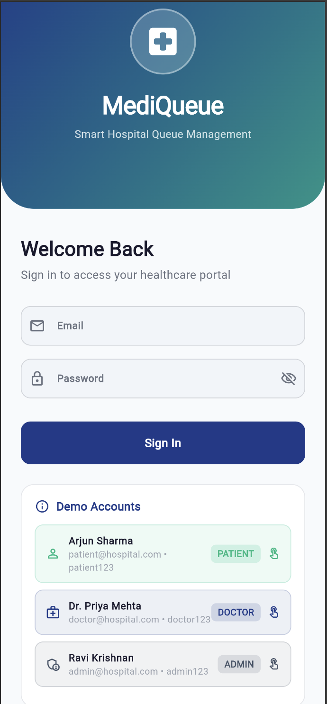
    </td>
  </tr>

  <tr>
    <td align="center">
      <strong>Notifications</strong><br><br>
      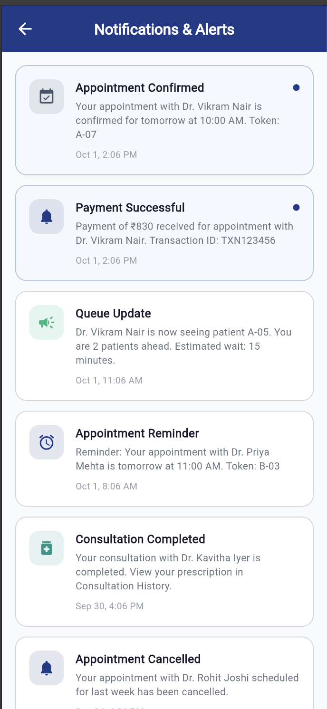
    </td>
    <td align="center">
      <strong>Patient Profile</strong><br><br>
      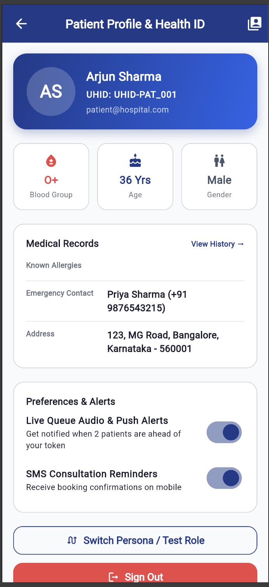
    </td>
  </tr>

  <tr>
    <td align="center">
      <strong>QR Check-in</strong><br><br>
      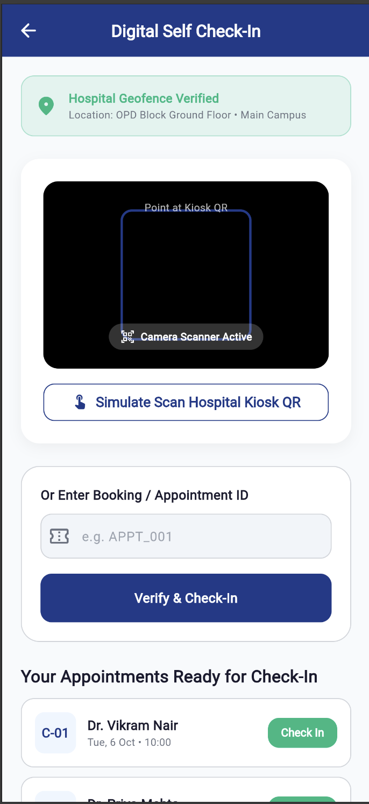
    </td>
    <td align="center">
      <strong>Admin Profile</strong><br><br>
      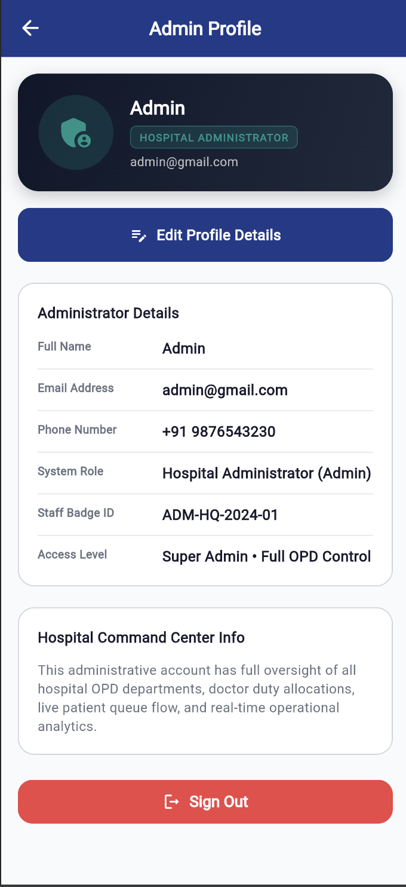
    </td>
  </tr>

  <tr>
    <td align="center">
      <strong>Admin Dashboard</strong><br><br>
      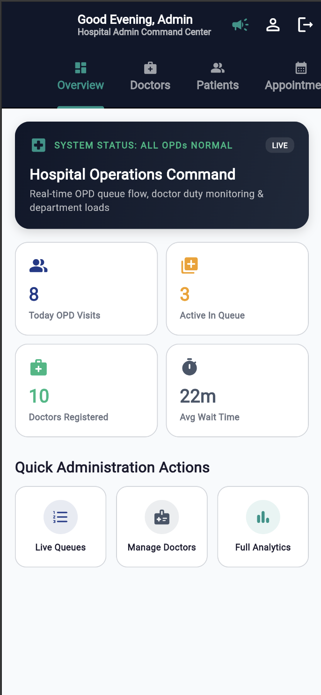
    </td>
    <td align="center">
      <strong>Doctor List</strong><br><br>
      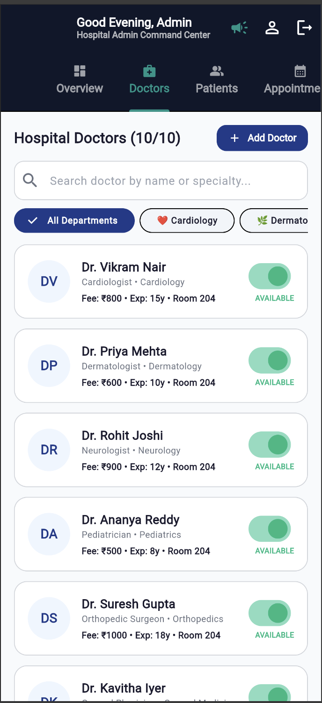
    </td>
  </tr>

  <tr>
    <td align="center">
      <strong>Firebase Integration</strong><br><br>
      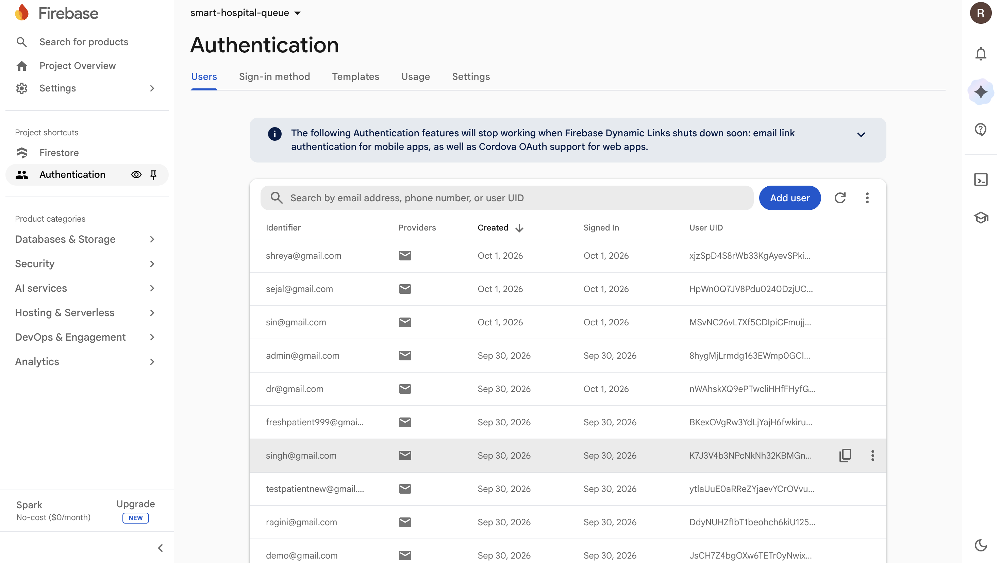
    </td>
    <td align="center">
      <strong>Firebase Project Connected</strong><br><br>
      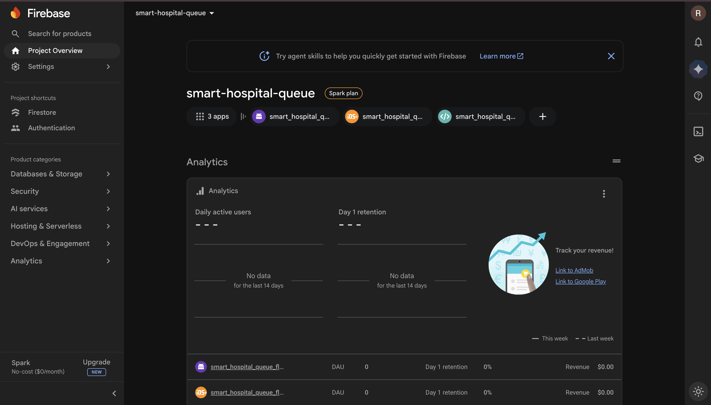
    </td>
  </tr>

  <tr>
    <td align="center">
      <strong>GitHub Repository</strong><br><br>
      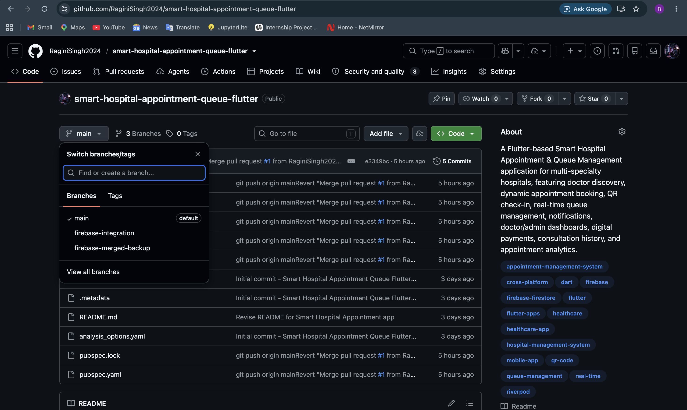
    </td>
    <td align="center">
      <strong>Patient List</strong><br><br>
      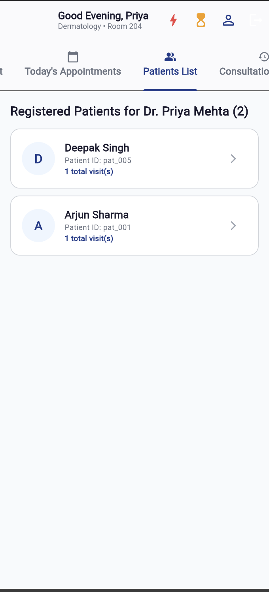
    </td>
  </tr>

  <tr>
    <td align="center">
      <strong>Doctor Dashboard</strong><br><br>
      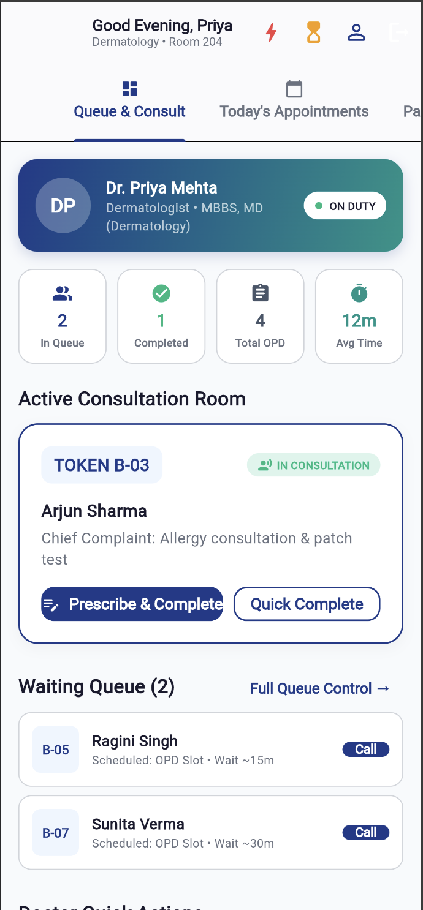
    </td>
    <td align="center">
      <strong>Doctor Profile</strong><br><br>
      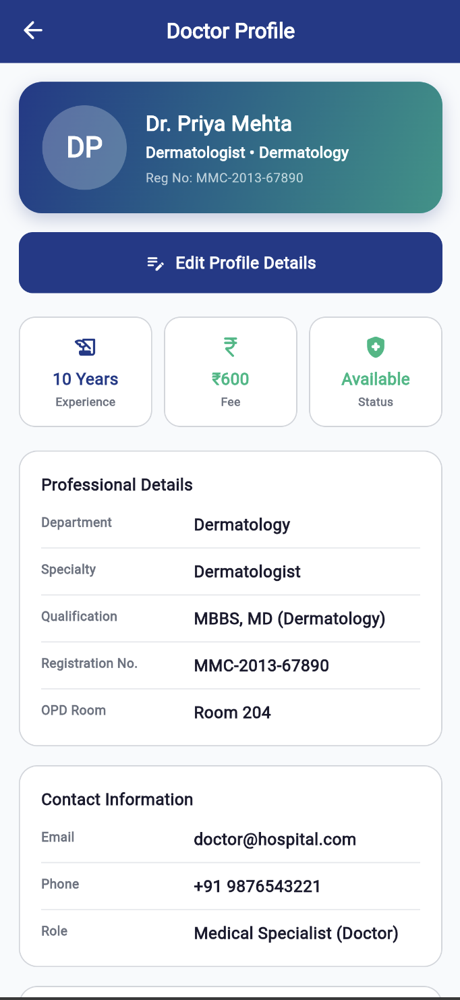
    </td>
  </tr>

  <tr>
    <td align="center">
      <strong>Doctor Today's Appointments</strong><br><br>
      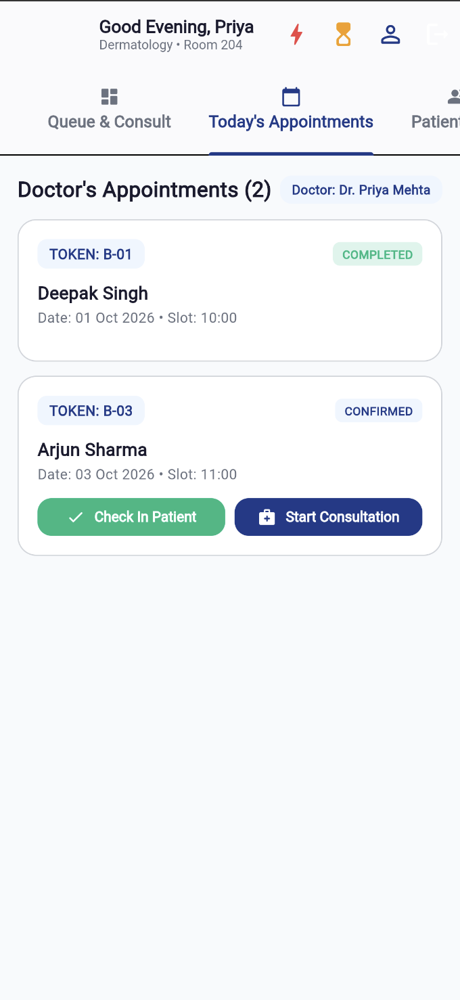
    </td>
    <td align="center">
      <!-- Empty cell for alignment -->
    </td>
  </tr>
</table>

## 📊 Analytics

The Admin Dashboard provides operational insights such as total appointments, completed appointments, pending appointments, cancelled appointments, doctor availability, department-wise appointments, patient flow, queue statistics, and appointment trends.

## 🚀 Getting Started

### Prerequisites

- Flutter SDK
- Dart SDK
- Git
- Android Studio / VS Code
- Firebase project
- Xcode for iOS development (if required)

Check Flutter installation:

```bash
flutter doctor
```

### 📥 Installation

Clone the repository:

```bash
git clone https://github.com/RaginiSingh2024/smart-hospital-appointment-queue-flutter.git
cd smart-hospital-appointment-queue-flutter
flutter pub get
```

### 🔥 Firebase Setup

Configure the required Firebase services:

- Firebase Authentication
- Cloud Firestore
- Firebase Cloud Messaging

Install FlutterFire CLI if required:

```bash
dart pub global activate flutterfire_cli
flutterfire configure
```

Run the application:

```bash
flutter run
```

### ▶️ Run on Web

```bash
flutter run -d chrome
```

### 🧪 Testing & Validation

```bash
flutter analyze
flutter test
flutter build web
```

## 🔐 Demo Credentials

| Role | Email | Password |
|---|---|---|
| Patient | Register through the app | User-defined |
| Doctor | `dr@gmail.com` | `dr1234` |
| Administrator | `admin@gmail.com` | `admin1234` |

## 🎬 Recommended Demo Flow

### Patient Demo
```text
Login → Find Doctor → Filter Specialty → Doctor Details
→ Check Availability → Select Slot → Book Appointment
→ Payment → Token → QR Check-in → Live Queue → History
```

### Doctor Demo
```text
Doctor Login → Doctor Dashboard → Today's Appointments
→ Patient Queue → Call Next Patient → Update Status
```

### Admin Demo
```text
Admin Login → Admin Dashboard → Doctors → Departments
→ Appointments → Patient Flow → Queue Statistics → Analytics
```

## 📄 Documentation

The project documentation/report contains the problem understanding, application design, implementation details, screenshots/demonstration, workflow, and feature documentation.

> **Documentation link:** Add the final uploaded DOCX/PDF documentation link here before submission.

## 🔗 Project Links

- 🚀 **Live Demo:** https://stitch.withgoogle.com/projects/6637076470176643694
- 🎨 **Design:** https://stitch.withgoogle.com/projects/6637076470176643694
- 💻 **GitHub Repository:** https://github.com/RaginiSingh2024/smart-hospital-appointment-queue-flutter
- 📄 **Documentation:** https://docs.google.com/document/d/1eiYQcvVTjwRtYDwx9UrUwjleejZ6VAGa2j5WTKpSyL0/edit?usp=sharing

## 📌 Project Information

**Problem Statement:** PS 147 — Smart Hospital Appointment & Queue Management

**Industry:** HealthTech & Healthcare

**Platform:** Flutter / Cross-platform

**Backend:** Firebase

**Application Name:** MediQueue

## 👩‍💻 Project

Developed as an academic HealthTech application for demonstrating cross-platform application development, role-based workflows, appointment management, digital queue management, and Firebase integration.

---

<p align="center">
  <strong>🏥 MediQueue — Smart Healthcare. Smarter Queues.</strong>
</p>
